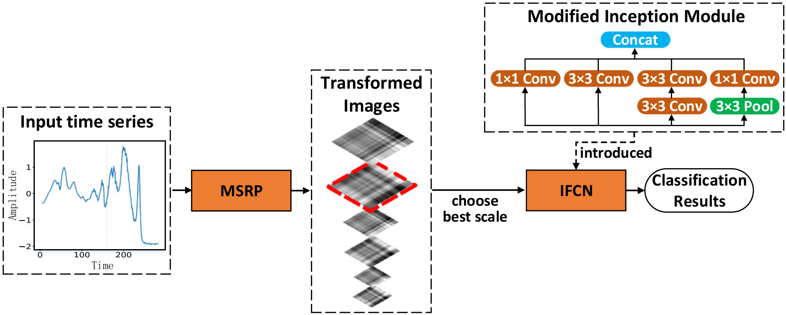

# Multi-scale Signed Recurrence Plot Based Time Series Classification Using Inception Architectural Networks
This is the project of manuscript 'Multi-scale Signed Recurrence Plot Based Time Series Classification Using Inception Architectural Networks'. This paper has been published at Pattern Recognition (2021) [[Paper]](https://www.sciencedirect.com/science/article/pii/S0031320321005653).



## Algorithm Introduction

This paper proposes a time series classification method, named MSRP-IFCN. It is composed of two submodules, the Multi-scale Signed RP (MSRP) and the Inception Fully Convolutional Network (IFCN). Experimental results on 85 UCR datasets indicate the superior performance of MSRP-IFCN. The contributions of this paper are summarized as follows:

1. We find an effective transformation representation for time series data by proposing MSRP. Compared with RP, MSRP better adapt to the variability of discriminative region scales and lengths of sequences, as well as tackle the tendency confusion problem. 
2. We propose an Inception architectural network, IFCN. IFCN outperforms other TSC networks in terms of extracting multi-scale features from MSRP images. 
3. Our proposed MSRP-IFCN performs well on 85 UCR datasets. 


## Citation

```
@article{zhang2022multi,
  title={Multi-scale signed recurrence plot based time series classification using inception architectural networks},
  author={Zhang, Ye and Hou, Yi and OuYang, Kewei and Zhou, Shilin},
  journal={Pattern Recognition},
  volume={123},
  pages={108385},
  year={2022},
  publisher={Elsevier}
}
```

## Prerequisite

Tested on Windows 10, with Python 3.6, PyTorch 1.1, CUDA 10.0, and 1x NVIDIA 2080Ti.

## Data Transformation

The original data used in this project comes from the [UCR/UEA archive](http://timeseriesclassification.com/TSC.zip), which contains the 85 univariate time series datasets. This project transforms these data into MSRP images for better discrimination.

**(1) Transform to MSRP images.**

```
Click on MSRP_Transform.py and run it. Or python MSRP_Transform.py
```

**(2) Transform to RP images.**

```
Click on RP_Transform.py and run it. Or python RP_Transform.py
```

**(3) Transform to TRP (Threshhold RP) images.**

```
Click on TRP_Transform.py and run it. Or python TRP_Transform.py
```

## Code 
The code is divided as follows: 
* The [main.py](https://github.com/hfawaz/ijcnn19ensemble/blob/master/src/main.py) python file contains the necessary code to run all experiements. 
* The [utils](https://github.com/hfawaz/ijcnn19ensemble/blob/master/src/utils/) folder contains the necessary functions to read the datasets and manipulate the data.
* The [classifiers](https://github.com/hfawaz/ijcnn19ensemble/tree/master/src/classifiers) folder contains eight python files one for each deep individual/ensemble classifier presented in our paper. 

To run a model on all datasets you should issue the following command: 

```
Click on main.py and run it. Adjust the hyperparameters in the constant file.
```

Or:

**(1) Train.**

```
python main.py --flag_train_or_test Train --ITERATIONS 1 --UNIVARIATE_ARCHIVE_NAMES MSRP_UCR_Archive --UNIVARIATE_DATASET_NAMES Coffee --CLASSIFIERS IFCN_torch --BATCH_SIZE 16 --EPOCH 1500 --model_save_interval 500 --LR 0.00005 --test_split 8
```
**(2) Test.**

```
python main.py --flag_train_or_test Test --UNIVARIATE_ARCHIVE_NAMES MSRP_UCR_Archive --UNIVARIATE_DATASET_NAMES Coffee --CLASSIFIERS IFCN_torch --EPOCH 1500 --model_save_interval 500 --test_split 8
```

*This code is partly borrowed from [InceptionTime](https://github.com/hfawaz/InceptionTime). Thanks to Hassan Ismail Fawaz.

## Referrence

Ismail Fawaz H, Lucas B, Forestier G, et al. Inceptiontime: Finding Alexnet For Time Series Classification [J]. Data Mining and Knowledge Discovery, 2020, 34(6): 1936-1962.